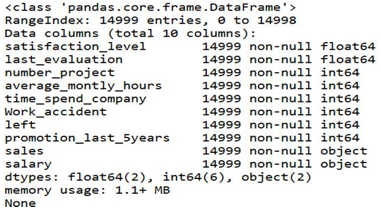
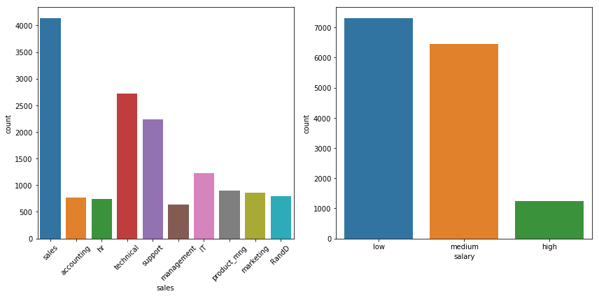
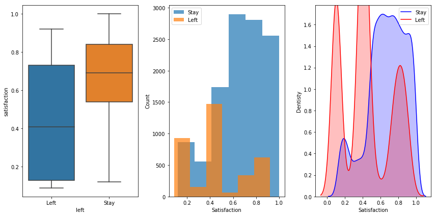
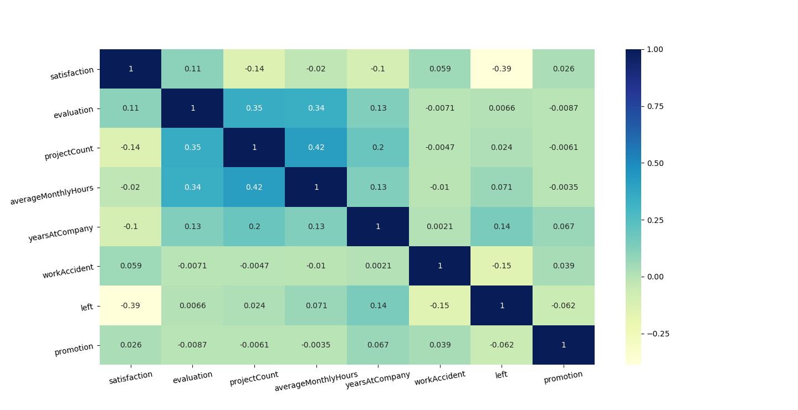
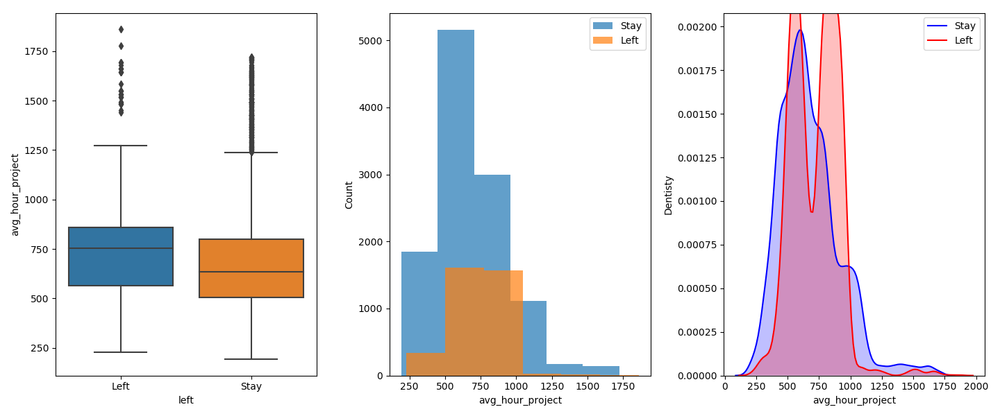
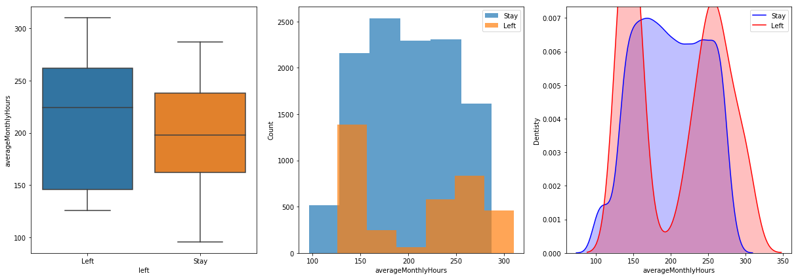
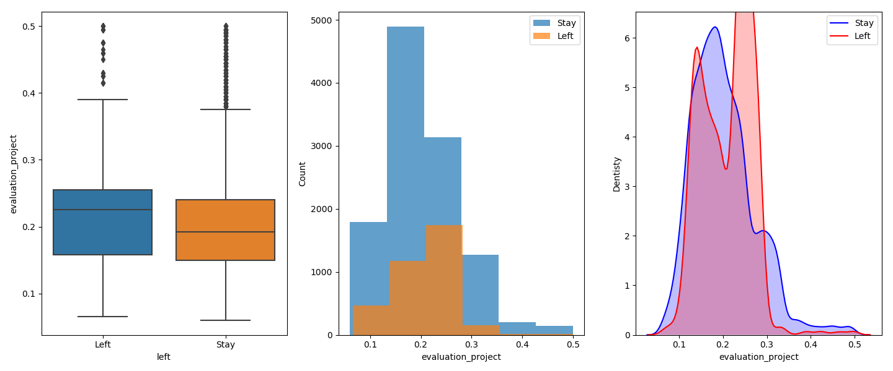
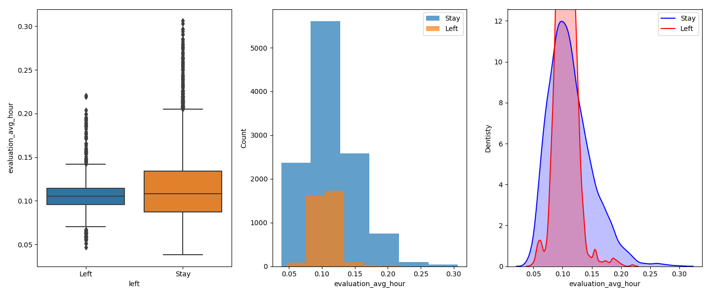
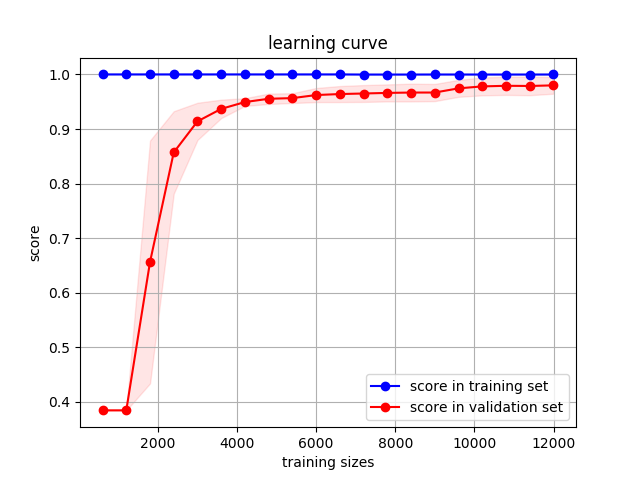

Human Resources Analytics
=========================

The Human Resources Analytics is a dataset providing informations on the situation and work of several ten of thousands employees. our purpose is to find why are the best and most experienced employees leaving prematurely? We want to know which factors contribute the most to the staff turnover rate and create a model that predicts if an employee will leave the company. In general, the implementation of the model will enable management level to make better decisions.

Data-Preprocessing and Transforming
------------------------------------

### Clean the Data
In order to better run some basic checks and see if there are missing values or unusual MAX Values in every variable. Pandas is an open source, BSD-licensed library providing high-performance, easy-to-use data structures and data analysis tools for the Python programming language. Pandas is a Python package providing fast, flexible, and expressive data structures designed to make working with "relational" or "labeled" data both easy and intuitive. It aims to be the fundamental high-level building block for doing practical, real world data analysis in Python. Additionally, it has the broader goal of becoming the most powerful and flexible open source data analysis / manipulation tool available in any language (Wes McKinney & PyData Development Team.2017). As a result, there are none of value missing.



### Rename the Features

For simple identification, we rename the certain features.

```
data = data.rename(columns={'satisfaction_level': 'satisfaction',
                            'last_evaluation': 'evaluation',
                            'number_project': 'projectCount',
                            'average_montly_hours': 'averageMonthlyHours',
                            'time_spend_company': 'yearsAtCompany',
                            'Work_accident': 'workAccident',
                            'promotion_last_5years': 'promotion',
                    })
```

### One-Hot-Encoding For Categorical Feature
In digital circuits, one-hot is a group of bits among which the legal combinations of values are only those with a single high (1) bit and all the others low (0). A similar implementation in which all bits are '1' except one '0' is sometimes called one-cold (Wikipedia.2017). So we just use the method is one-hot to deal with the solution.

Lists the distribution of numbers in different departments that the performance of the data set. It obviously finds that sales is the largest number for other departments and overall salaries are unexpected.


```
columns=['sales','salary']
data = numerical_string_feature(columns)
data = cut_sales()
```

### Group Features
We can use the feature segmentation to Cut that satisfaction, projectCount, evaluation, average_Monthly_Hours and so on. For example, satisfaction is according cross-comparison between left and stay.



```
columns =['avg_hour_project','averageMonthlyHours']
data =scale_data(columns,scale='Maxmin')
```

### Correlation of the Features


                    
From the below figure, there is a positive(+) correlation between projectCount, average_monthly_hours, and evaluation. Which could mean that the employees who spent more hours and did more projects were evaluated highly.

For the negative(-) relationships, left and satisfaction are highly correlated. It may that people tend to leave a company more when they are less satisfied.

### Feature Generation
Accoring to correlation of the features, we create new features including averagehourProject, averageMonthlyHours, evaluation_avg_hour, evalution_porject.

```
#a. create new feature avg_hour_project
    data['avg_hour_project'] = (data['averageMonthlyHours'] * 12) / data['projectCount']

#b. create new feature evaluation_project
    data['evaluation_project'] = data['evaluation']/data['projectCount']
    
#c. creat new feature evaluation_avg_hour
    data['evaluation_avg_hour'] = data['evaluation']/(data['averageMonthlyHours']/30)
```

##### AvgHourProject


##### AverageMonthlyHours


##### EvaluationProject


##### EvaluationAvgHour


Modeling
--------
With the data overlying, the liner classificatier will not do well such task, so we need to use the tree model to cut the data. And the decision tree is easily over-fitting, so we need to involve more than one tree to train, and that is why we use boosting model. And in the boosting model, the XGBoost may be better than the Gradient Boosting (GBM) model, because the XGBoost has the regular item to avoid over-fitting, so we choose the XGBoost at last.

```
#a. create a Classifier object 
    xgbc =Classifier(xgb.XGBClassifier,'xgbc',X_train,y_train,seed=0,params=xgb_params,scoring='f1')
    
    
#b. use GridSearch for finding best parameter (But it's not necessary since we have already find the best parameter)
#    xgbc.GridSearch(xgb_parameters)

#c. get the CrossValidationScore(the assesment criterion is 'f1')
#    print (xgbc.CrossValScore(mean=True))

#d. visualize the feature_importance 
#    plot_feature_importance_final_model(plot = True)

#e. visualize the learning_curve to diagnose the model (whether the model is underfitting or overfitting)
#    plot_learning_curve_final_model(plot=True)
    
```

#### Performance
After the model, the mean of accuracy socre(cross-validation generator = 5) is 
***99.0666%*** . More than that, the learning curve shows the model doesn't overfit. 


Conclusion
==========
Long-term success, a healthy work environment, and high employee retention are all signs of a successful company. Maintaining these situation is a precondition for the company's sustainable development. Recognizing and understanding the three main factors(Satisfaction, evaluation and time_spend_company) that associated with employee turnover will allow companies to limit this from happening and increase employee productivity and growth. These predictive insights allow managers to make predictions and have the opportunity to take corrective action to establish and maintain a successful business.

                        

